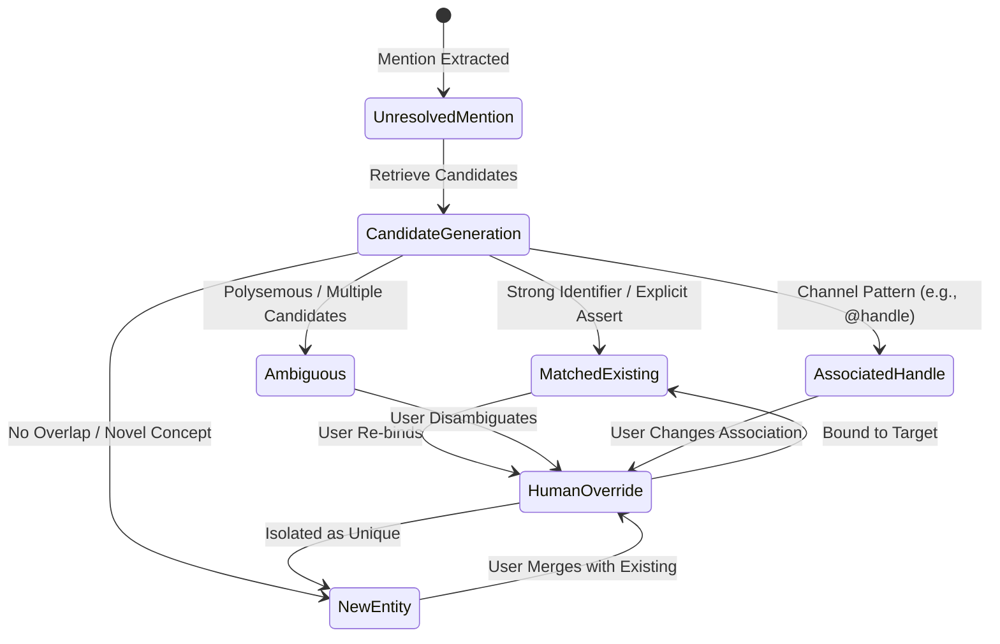
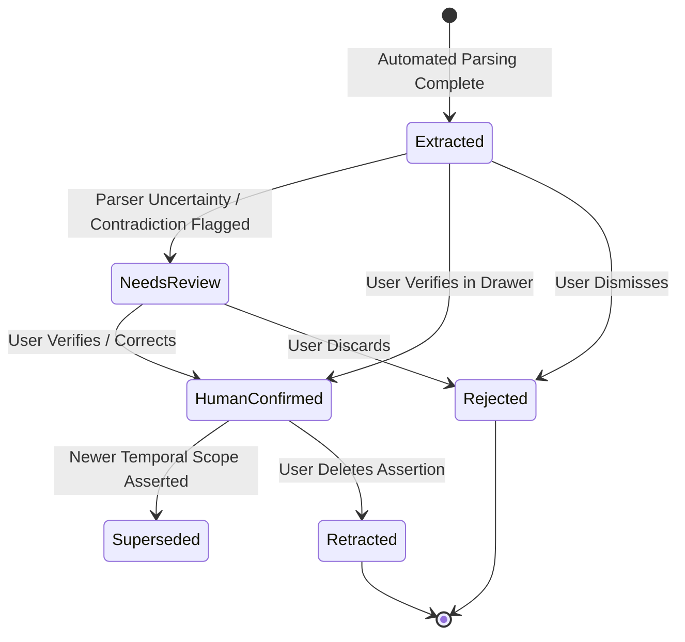
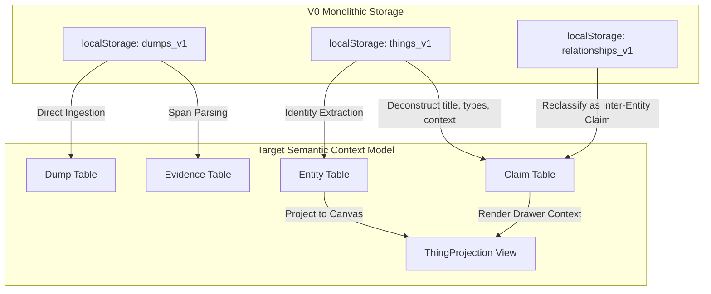

# Domain Data Schema & State Specification

**Status:** Approved Schematic Design v1.0  
**Project:** Map of Chaos  
**Purpose:** Formalize the domain entities, state machines, lifecycle models, and persistence schemas bridging the conceptual contracts (`context_model_contract.md`, `entity_resolution_contract.md`, `semantic_extraction_contract.md`, `runtime_pipeline_design.md`) into a concrete specification for TypeScript implementation.

---

## 1. Architectural Resolutions

Before defining schemas, this specification formalizes four critical architectural decisions that govern state transitions, provenance, epistemic rigor, and projection boundaries.

---

### 1.1 Resolution 1: Entity–Claim Binding & Provenance Lineage

Claims must semantically bind to persistent Entities while maintaining immutable provenance back to the original human utterance.

```text
SEMANTIC LEVEL:    Claim ───────────────► Subject: Entity A (Dynamic Binding)
                     │
PROVENANCE LEVEL:    └─► Derived From: Mention ──► Evidence Span ──► Dump (Immutable)
```

#### The Revisable Resolution Invariant
Entity Resolution is a **derived, revisable relationship**. If Mention $M_1$ initially resolves to Entity $E_1$, and later evidence demonstrates that $M_1$ actually refers to Entity $E_2$:

1. **Evidence is Invariant:** The originating `Dump`, `Evidence`, and `Mention` records are immutable and untouched.
2. **Resolution Versioning:** The previous `EntityResolution` record is marked `status: 'superseded'`. A new `EntityResolution` record is created linking $M_1 \rightarrow E_2$ with provenance, rationale, and timestamp.
3. **Claim Re-Binding:**
   - Claims derived from $M_1$ have their `subjectEntityId` updated to $E_2$.
   - A `ClaimBindingAudit` event is logged recording: `claimId`, `previousEntityId: E_1`, `newEntityId: E_2`, `resolutionId`, `timestamp`.
   - The historical association is fully auditable.
4. **Zero Data Destruction:** No historical Dump, Evidence, or Claim is deleted. If $E_1$ now has zero claims, it remains as an empty/dormant Entity or is archived, never silently expunged.

---

### 1.2 Resolution 2: Human Assertion Origin vs. Machine Extraction State

To prevent AI parser output from masquerading as unquestionable human fact, every Claim decouples the **origin of the assertion** from the **review state of its extracted representation**:

```text
AXIS A: Source Origin (Where did the semantic proposition come from?)
├── human_stated   (Directly stated/authored by the human in raw input)
└── ai_inferred    (Deductive hypothesis, contextual link, or abstraction proposed by AI)

AXIS B: Review State (Has the extracted structure been verified?)
├── extracted       (Generated by automated parser; structurally valid, unreviewed)
├── needs_review    (Flagged due to low extraction confidence, ambiguous phrasing, or conflict)
├── human_confirmed (Explicitly reviewed and verified by the user)
└── rejected        (Explicitly dismissed or corrected by the user)
```

#### Rule of Semantic Truth:
If a human writes:
> *"Nalakara adalah salah satu lini usaha saya."*

The parser extracts:
```typescript
Claim {
  subject: "Nalakara",
  predicate: "is_a",
  object: "business_line",
  sourceOrigin: "human_stated",  // Grounded in human utterance
  reviewState: "extracted"       // Machine-structured; NOT yet confirmed as fact
}
```
The assertion is recognized as human in origin, but the machine extraction is kept provisional until confirmed by user behavior or explicit confirmation.

---

### 1.3 Resolution 3: Unprojected Semantic Context

The Map Canvas is a **spatial memory projection**, not the database of record. An Entity or Claim does not need a visual canvas node or edge to exist, be searched, or provide context.

#### Unprojected Context Access Matrix:

| Subsystem | Function for Unprojected Context | Interaction Model |
|---|---|---|
| **Map Canvas** | Projects high-salience, pinned, or explicitly explored Entities as **Things**. Secondary assets and handles remain unprojected nodes. | Spatial exploration, dragging, clustering, direct visual anchoring. |
| **Context Catalog** | A complete, non-spatial directory of all persistent Entities, Claims, and Inventories. | Filterable listing by type, domain, status, or date; full inspection drawer. |
| **Search Engine** | Queries across all Dumps, Evidence, Mentions, and Claims regardless of projection state. | Instant prefix, token, and semantic search; jumps directly to Entity or Dump. |
| **Wander** | Retrieves both projected and unprojected context (equipment, accounts, past intentions). | Surface background evidence relevant to user reflections without canvas clutter. |
| **Unresolved Context Hub** | Surfaces Claims and Mentions with `reviewState: 'needs_review'` or `resolutionState: 'ambiguous'`. | **Non-judgmental inspection.** Explicitly NOT an "Inbox Zero" task queue. Unresolved items may remain open indefinitely. |

---

### 1.4 Resolution 4: Human Override vs. Machine Reprocessing

When prompt templates, extraction heuristics, or machine learning models improve, historical Dumps must be reprocessable without overwriting human choices.

#### Precedence Axiom:
$$\mathbf{Human\ Decision} \succ \mathbf{Machine\ Reprocessing} \succ \mathbf{Historical\ Machine\ Derivation}$$

1. **Decoupled Records:** Machine suggestions and Human decisions are stored as separate records.
2. **Active Resolution Selector:**
   ```typescript
   activeEntityId = humanOverride?.targetEntityId ?? latestMachineResolution?.targetEntityId;
   ```
3. **Reprocessing Safety Rules:**
   - If historical Dump $D_1$ is reprocessed by Extractor v2:
     - New machine suggestions are recorded with `version: 2`.
     - Any resolution or claim bearing `reviewState: 'human_confirmed'` or `reviewState: 'rejected'` is **immune to automated overwrite**.
     - If Extractor v2 fails to find a claim that the human previously confirmed, the claim is **retained**.
     - If Extractor v2 finds a genuinely new claim, it is appended with `reviewState: 'extracted'`.
     - If an unconfirmed claim (`reviewState: 'extracted'`) is no longer supported by Extractor v2, it is marked `status: 'superseded_by_reprocessing'`.

---

## 2. Domain Schemas (TypeScript Design Schemas)

*Note: The following interfaces represent schematic domain definitions, not runtime implementation code.*

### 2.1 Dump
The immutable capture event.

```typescript
export interface Dump {
  readonly id: string;                    // UUID (e.g., 'dump-1728123456')
  readonly rawText: string;               // Verbatim user input
  readonly createdAt: string;             // ISO-8601 observation timestamp
  readonly source: 'web_dock' | 'pwa' | 'api' | 'import';
  processingStatus: 'captured' | 'processing' | 'processed' | 'failed';
  processorVersion?: string;             // Version of extractor that processed this
  errorMessage?: string;
}
```

### 2.2 Evidence
The immutable grounding span within a Dump.

```typescript
export interface Evidence {
  readonly id: string;                    // UUID
  readonly dumpId: string;                // Reference to parent Dump
  readonly textSpan: string;              // Exact verbatim excerpt
  readonly startOffset: number;           // Character start offset in Dump.rawText
  readonly endOffset: number;             // Character end offset in Dump.rawText
  readonly createdAt: string;             // ISO-8601 (matches Dump.createdAt)
}
```

### 2.3 Mention
A discrete candidate entity mention identified in text prior to identity resolution.

```typescript
export interface Mention {
  readonly id: string;                    // UUID
  readonly evidenceId: string;            // Direct pointer to text span
  readonly dumpId: string;                // Pointer to root Dump
  readonly surfaceForm: string;           // Verbatim phrase (e.g., "nalakara.id", "Nalakara")
  readonly normalizedForm: string;        // Cleaned string (lowercase, trimmed)
  candidateTypeHint?: string;             // e.g., 'account', 'organization', 'project'
  readonly createdAt: string;             // ISO-8601
}
```

### 2.4 EntityResolution
The revisable binding between a Mention and a persistent Entity.

```typescript
export type ResolutionOutcome = 
  | 'matched_existing'   // Confidently linked to existing Entity
  | 'new_entity'          // Instantiated new Entity
  | 'ambiguous'           // Matches multiple candidates; unresolved
  | 'associated_handle';  // Channel/handle belonging to an Entity

export interface EntityResolution {
  readonly id: string;                    // UUID
  readonly mentionId: string;             // Mention being resolved
  readonly targetEntityId?: string;       // Bound Entity ID (null if ambiguous)
  readonly outcome: ResolutionOutcome;
  readonly confidence: number;            // 0.0 to 1.0 (machine assessment)
  readonly rationale: string;             // Human or machine explanation
  readonly createdBy: 'machine' | 'human_override';
  status: 'active' | 'superseded';
  candidateEntityIds?: string[];          // Candidates considered if ambiguous
  overrideReason?: string;               // Filled if createdBy === 'human_override'
  readonly createdAt: string;             // ISO-8601
}
```

### 2.5 Entity
A persistent semantic identity in the Context Model.

```typescript
export interface Entity {
  readonly id: string;                    // UUID (e.g., 'ent-nalakara-01')
  canonicalName: string;                  // Primary human-readable identifier
  aliases: string[];                      // Alternate names, nicknames, acronyms
  associatedHandles: string[];            // Digital presence (e.g., ['@nalakara.id'])
  epistemicStatus: 'verified' | 'unverified' | 'unknown';
  resolutionStatus: 'resolved' | 'ambiguous' | 'provisional';
  readonly createdAt: string;             // When first instantiated
  updatedAt: string;
}
```

### 2.6 Claim
The universal semantic assertion primitive.

```typescript
export type TemporalScope = 
  | 'past'        // Historical / "used to"
  | 'present'     // Current / ongoing / "now"
  | 'future'      // Intended / planned / "eventually"
  | 'recurring'   // Habitual / "I receive orders"
  | 'timeless';   // Permanent or static fact

export interface ClaimQualifiers {
  quantity?: number;                      // e.g., 5 accounts, 2 machines
  partitivity?: string;                   // e.g., "one of my business lines"
  purpose?: string;                       // e.g., "for myself"
  modality?: string;                      // e.g., "eventually", "maybe", "researching"
  degree?: string;                        // e.g., "more", "partially"
  condition?: string;                     // e.g., "if time permits"
}

export interface Claim {
  readonly id: string;                    // UUID
  subjectEntityId: string;                // Subject Entity ID
  predicate: string;                      // Semantic relation (e.g., 'owns', 'is_a', 'focuses_on')
  
  // Object: either an Entity ID (Relational Claim) or Literal/Concept (Attribute Claim)
  objectValue: {
    type: 'entity_id' | 'literal' | 'concept';
    value: string;                        // Entity UUID or string literal
  };

  qualifiers?: ClaimQualifiers;
  
  // Temporal Separation
  readonly observationTime: string;       // Dump timestamp (when observed)
  temporalScope: TemporalScope;           // When the claim is valid in reality
  validityDetails?: string;               // e.g., "stopped in June", "now"

  // Dual Epistemic Framework
  sourceOrigin: 'human_stated' | 'ai_inferred';
  reviewState: 'extracted' | 'needs_review' | 'human_confirmed' | 'rejected';

  // Grounding & Provenance
  readonly dumpId: string;                // Originating Dump
  readonly mentionId?: string;            // Originating Mention (if applicable)
  readonly evidenceId: string;            // Supporting Evidence Span
  supportingEvidenceIds: string[];        // Additional Evidence records reinforcing this claim

  // Conflict & Lifecycle
  conflictState?: 'none' | 'temporal_shift' | 'direct_contradiction';
  conflictingClaimIds?: string[];
  status: 'active' | 'superseded' | 'retracted';
  readonly createdAt: string;
  updatedAt: string;
}
```

### 2.7 ExtractionResult
The raw, unmerged output of a semantic extraction execution.

```typescript
export interface ExtractedMentionCandidate {
  surfaceForm: string;
  textSpan: string;
  startOffset: number;
  endOffset: number;
  typeHint?: string;
}

export interface ExtractedClaimCandidate {
  subjectMentionSurface: string;
  predicate: string;
  objectValue: {
    type: 'mention_surface' | 'literal' | 'concept';
    value: string;
  };
  qualifiers?: ClaimQualifiers;
  temporalScope: TemporalScope;
  textSpan: string;
  startOffset: number;
  endOffset: number;
  extractionConfidence: number;           // Extractor's internal parse confidence
}

export interface ExtractionResult {
  readonly dumpId: string;
  readonly extractorVersion: string;
  mentions: ExtractedMentionCandidate[];
  claims: ExtractedClaimCandidate[];
  rawObservations: string[];              // Open questions / unresolved musings
  readonly executedAt: string;
}
```

### 2.8 HumanOverride / HumanDecision
The authoritative log of user corrections over automated operations.

```typescript
export interface HumanOverride {
  readonly id: string;                    // UUID
  readonly targetType: 'entity_resolution' | 'claim_review' | 'entity_merge' | 'entity_split';
  readonly targetId: string;              // Mention ID, Claim ID, or Entity ID
  readonly action: 'bind_to_entity' | 'confirm_claim' | 'reject_claim' | 'merge_entities' | 'split_entity';
  readonly payload: Record<string, any>;   // Explicit parameters chosen by human
  readonly userNotes?: string;
  readonly createdAt: string;             // ISO-8601
}
```

### 2.9 ThingProjection
The derived view model rendered by the Map Canvas.

```typescript
export interface ThingProjection {
  readonly id: string;                    // Derived Thing ID (maps 1:1 with primary Entity ID)
  readonly entityId: string;              // Root persistent Entity
  
  // Projected Display Attributes
  title: string;                          // Derived from Entity.canonicalName or fallback claim
  summary?: string;                       // Synthesized from active claims
  displayTypes: string[];                 // Derived from active 'is_a' / 'operates_as' Claims
  uncertaintyBadge: 'verified' | 'unverified' | 'unknown' | 'ambiguous';

  // Projection Metadata
  isProjected: boolean;                   // False if relegated to Catalog/Drawer only
  projectionReason: 'user_pinned' | 'high_salience' | 'explicit_focus' | 'isolated_presence';

  // Projected Graph Geometry (Canvas view state)
  x?: number;
  y?: number;
  radius: number;                         // Calculated dynamically from degree / centrality
  degree: number;                         // Count of active projected edges

  readonly projectedAt: string;
}

export interface EdgeProjection {
  readonly id: string;                    // Derived Edge ID
  readonly claimId: string;               // Supporting Relational Claim ID
  readonly sourceThingId: string;         // Subject Thing ID
  readonly targetThingId: string;         // Object Thing ID
  readonly label: string;                 // Derived from Claim.predicate
  readonly style: 'solid' | 'dashed';     // solid = human_confirmed; dashed = ai_inferred / extracted
  readonly isVisible: boolean;
}
```

---

## 3. Lifecycle State Machines

### 3.1 Entity Resolution State Machine



- **Candidate Generation Rule:** Lexical similarity creates candidate links for scoring, but **cannot transition to `MatchedExisting` without structural or explicit evidence**.
- **Ambiguity Invariant:** Mentions in state `Ambiguous` remain attached to candidate pools without mutating existing Entity facts until disambiguated.

---

### 3.2 Claim Review State Machine



---

## 4. Reprocessing & Versioning Protocol

To satisfy Contract Invariant 12 (*"Reprocessing must preserve provenance and avoid duplication"*):

```text
[Historical Dump] ──► Extractor v1 ──► ExtractionResult v1 ──► Claims (v1)
        │
        └─ (Prompt / Model Upgrade)
        │
        ▼
[Historical Dump] ──► Extractor v2 ──► ExtractionResult v2 ──► Reconciler ──► Context Store
```

### Reconciliation Algorithm:
1. **Fetch Prior State:** Retrieve existing Claims and Mentions linked to `dumpId`.
2. **Lock Human Decisions:** Any Claim with `reviewState: 'human_confirmed'` or `reviewState: 'rejected'` is flagged **IMMUTABLE**.
3. **Match Candidates:** For each candidate claim $C_{new}$ from Extractor v2:
   - Match against existing claims on `(subjectEntityId, predicate, objectValue)`.
   - If match found with locked claim: Retain human review state; update `supportingEvidenceIds` if span precision improved.
   - If match found with unreviewed claim (`extracted`): Update qualifiers and confidence; increment `processorVersion`.
   - If no match found: Insert as new claim with `reviewState: 'extracted'`.
4. **Prune Stale Machine State:** Any unreviewed claim (`reviewState: 'extracted'`) from v1 that has **zero support** in v2 is marked `status: 'superseded_by_reprocessing'`.

---

## 5. V0 Prototype Migration Specification

The existing codebase in `src/` represents a monolithic V0 prototype. This section defines the precise migration bridge.



### 5.1 Object-by-Object Migration Map

| Legacy V0 Construct | Target Context Model Primitive | Migration Action & Boundary Rules |
|---|---|---|
| `Dump` (`types.ts:73`) | `Dump` + `Evidence` | Direct migration. `rawText` and `timestamp` migrate 1:1. Generate initial `Evidence` record encompassing the full text. |
| `Thing` (`types.ts:30`) | `Entity` + `Claims` + `ThingProjection` | **Deconstruct completely.** Do not preserve `Thing` as a database row.<br>1. Mint `Entity` with `canonicalName = Thing.title`.<br>2. Migrate `Thing.types[]` to individual `Claim(is_a, type)` records.<br>3. Migrate `Thing.context` to individual attribute Claims.<br>4. Store `(x, y, radius)` in `ThingProjection`. |
| `Thing.description` | `Evidence` or `Claim` | If description equals original dump, treat as raw evidence. If description was human-edited, migrate as `Claim(has_description, text)` with `sourceOrigin: 'human_stated'`. |
| `Thing.uncertaintyState` | `Entity.epistemicStatus` | Map `unknown` $\rightarrow$ `unknown`; `unverified` $\rightarrow$ `unverified`; `verified` $\rightarrow$ `verified`. |
| `Thing.aiInterpretation` | `Claim` (`sourceOrigin: 'ai_inferred'`) | Deconstruct suggested types and summaries into derived Claims with `sourceOrigin: 'ai_inferred'` and `reviewState: 'extracted'`. |
| `Relationship` (`types.ts:63`) | `Claim` (Relational) | Reclassify as an inter-entity Claim: `Claim(source, label, target)`. If `type === 'user_confirmed'`, set `reviewState: 'human_confirmed'`. If `type === 'ai_suggested'`, set `sourceOrigin: 'ai_inferred'`. |
| `ROOT_NODE_ID` (`'node-root-yudhan'`) | **DEPRECATE** | **Do not import into Entity store.** Remove hardcoded root node. Store `"Yudhan"` as a standard User Entity if context requires it, but remove the forced canvas coordinate anchor `(0, 0)`. |
| `INITIAL_THINGS` (`initialData.ts`) | Seed Fixture Only | Isolate demo items into a seed script. Never let demo fixtures overwrite active context storage. |

### 5.2 Strict Prohibition
> **CRITICAL DIRECTIVE:** The implementation team is explicitly prohibited from stuffing the new Claim model into legacy fields such as `Thing.description`, `Thing.types[]`, or `Thing.aiInterpretation`. The legacy storage keys `map_of_chaos_things_v1` must be superseded by the Context Model store.

---

## 6. Canonical Test Validation Matrix

The schema is verified against the nine established canonical benchmarks:

```text
==================================================================================
TEST 1: "I have 5 Instagram accounts: freshbeda, yudhan.sebastian, nalakara.id, 
         rampainusa, matatua."
==================================================================================
- Mentions: 5 Mention records with surface forms.
- Claims: Claim(User, owns, Instagram Accounts) with qualifiers { quantity: 5 }.
  5 individual Claim(User, has_handle, "@handle") records.
- Projection: 1 primary Thing (User or Account Group); 5 handles accessible in 
  Drawer without spawning 5 canvas nodes.

==================================================================================
TEST 2: "Nalakara is one of my business lines, working in technology and AI."
==================================================================================
- Entity: Nalakara (canonicalName: "Nalakara").
- Claims:
  - Claim(Nalakara, is_a, business_line) [qualifier: { partitivity: "one of" }]
  - Claim(Nalakara, operates_in, technology)
  - Claim(Nalakara, operates_in, AI)
- Temporal: temporalScope = 'present', observationTime = dump.createdAt.

==================================================================================
TEST 3: "Freshbeda is another business line related to visual design."
==================================================================================
- Entity: Freshbeda (canonicalName: "Freshbeda").
- Claims: Claim(Freshbeda, is_a, business_line), Claim(Freshbeda, operates_in, visual_design).
- Resolution Guard: EntityResolution evaluates mention "Freshbeda" vs handle 
  "freshbeda" from Test 1. Outcome: 'new_entity' (Tokens match, but entities remain 
  distinct without explicit linkage).

==================================================================================
TEST 4: "nalakara.id is the Instagram account for Nalakara."
==================================================================================
- Entities: nalakara.id (Handle/Asset) + Nalakara (Business Line).
- Claim: Claim(nalakara.id, is_instagram_account_of, Nalakara).
- Resolution: Outcome: 'associated_handle'. Updates Entity(Nalakara).associatedHandles.

==================================================================================
TEST 5: "I used to focus Nalakara on visual design, but now I use it more for AI."
==================================================================================
- Entity: Nalakara.
- Claims:
  - Claim(Nalakara, focuses_on, visual_design) [temporalScope: 'past', details: "used to"]
  - Claim(Nalakara, focuses_on, AI) [temporalScope: 'present', qualifiers: { degree: "more" }]
- Contradiction: conflictState = 'temporal_shift'. Both preserved; zero deletion.

==================================================================================
TEST 6: "I have 2 coffee machines, 1 roasting machine, 1 freezer, 2 refrigerators."
==================================================================================
- Claims: 4 Claims on User with predicate 'owns_equipment', objects 'coffee machine',
  'roasting machine', 'freezer', 'refrigerator', each carrying qualifiers.quantity.
- Projection: Equipment listed in Context Catalog; zero phantom machine nodes on canvas.

==================================================================================
TEST 7: "I receive orders for coffee blends."
==================================================================================
- Claim: Claim(User, receives_orders_for, coffee_blends) [temporalScope: 'recurring'].
- Guard: Does not instantiate a premature 'Order' entity without evidence.

==================================================================================
TEST 8: "I make yoghurt for myself and eventually I will sell it too."
==================================================================================
- Claims:
  - Claim(User, makes, yoghurt) [temporalScope: 'present', qualifiers: { purpose: "for myself" }]
  - Claim(User, intends_to_sell, yoghurt) [temporalScope: 'future', qualifiers: { modality: "eventually" }]
- Guard: Prevents classifying user as an active commercial yoghurt vendor.

==================================================================================
TEST 9: "I am researching how to make faceless YouTube videos."
==================================================================================
- Claim: Claim(User, researching, "faceless YouTube videos") [temporalScope: 'present'].
- Guard: Captures open creative exploration without generating a false 'YouTube Channel' project.
```

---

## 7. Self-Audit Against Conceptual Contracts

1. **Dump → Evidence Boundary:** **PASS.** Verbatim text is immutable; character offsets guarantee exact span attribution.
2. **Extraction vs. Resolution:** **PASS.** Extraction yields unbound mentions; resolution binds mentions via versioned `EntityResolution` records.
3. **Context Accumulation:** **PASS.** Claims accumulate additively. Multiple dumps reinforce identical claims via `supportingEvidenceIds`.
4. **Epistemic Integrity:** **PASS.** Decoupled `sourceOrigin` (`human_stated` vs `ai_inferred`) from `reviewState` (`extracted` vs `human_confirmed`).
5. **Projection Sovereignty:** **PASS.** `ThingProjection` and `EdgeProjection` are downstream, rebuildable views over `Entity` and `Claim`.
6. **Reprocessing & Provenance:** **PASS.** Reconciliation preserves human overrides and prevents duplicate explosion.
