# Map of Chaos — Implementation Architecture

**Status:** Implementation Architecture & Technical Design v1.0  
**Project:** Map of Chaos  
**Target:** Implementation blueprint for the React/Vite/TypeScript progressive web app  
**Context:** Based on frozen domain contracts (`context_model_contract.md`, `entity_resolution_contract.md`, `semantic_extraction_contract.md`, `relationship_contract.md`, `thing_contract.md`, `runtime_pipeline_design.md`, `domain_data_schema_and_state_spec.md`).

---

## 1. Architectural Objective

The objective of this architecture is to translate the conceptual Context Model into a clean, local-first, performant implementation inside the existing Vite/React/TypeScript PWA repository without compromising the core domain invariants:

```text
USER DUMP
   │
   ▼
DUMP & EVIDENCE STORE (Immutable, Append-Only)
   │
   ▼
SEMANTIC EXTRACTION (Spans, Candidate Mentions, Explicit Claims, Qualifiers, Temporal Scopes)
   │
   ▼
ENTITY RESOLUTION (Candidate Generation ──► Resolution Decision with Revision & Override Tracking)
   │
   ▼
CONTEXT STORE (Persistent Entities, Additive Claims, Evidence Attachment, Contradiction Flags)
   │
   ▼
INFERENCE (Derived AI Hypotheses, Clearly Quarantined from Human Facts)
   │
   ▼
PROJECTION ENGINE (Transforms Context into Selective ThingProjection & EdgeProjection)
   │
   ▼
USER INTERFACES (MapCanvas, Context Catalog, Inspection Drawer, Wander Retrieval, Unresolved Hub)
```

### Core Invariants Preserved
1. **Original human input is immutable evidence** (never overwritten or summarized away).
2. **Context accumulates additively** via universal Claims; an Entity is not a single mutable text field.
3. **Entity Resolution is revisable derived state**; re-binding a Mention to a different Entity updates Claim bindings with an audit trail without destroying underlying evidence.
4. **Human decisions strictly outrank machine reprocessing** ($\text{Human Decision} \succ \text{Machine Reprocessing} \succ \text{Machine Derivation}$).
5. **The Map is a projection layer, not the database of truth**; non-projected context remains fully accessible through catalog, search, and Wander.

---

## 2. Current Codebase Analysis (V0 Audit)

The current repository is a monolithic single-screen prototype built around the legacy equation `Dump → Thing → Graph`.

### 2.1 Current Implementation Inventory

| Subsystem | File(s) | Current V0 Behavior | Classification | Target Action in V1 Architecture |
|---|---|---|---|---|
| **Domain Types** | `src/types.ts` | Conflates `Thing` as the sole root entity. Static `types: ThingType[]`. `Relationship` stored as top-level array. Hardcodes `isRoot?: boolean`. | **REPLACE** | Replace with clean domain interfaces from `domain_data_schema_and_state_spec.md` (`Dump`, `Evidence`, `Mention`, `Entity`, `Claim`, `EntityResolution`, `ThingProjection`). |
| **Persistence** | `src/App.tsx:20-100` | 4 separate `localStorage` keys (`things_v1`, `relationships_v1`, `dumps_v1`, `wanders_v1`). No transactions, 5MB limit, prone to desynchronization. | **REPLACE** | Replace with typed IndexedDB repository layer (`src/storage/`). |
| **Capture Flow** | `src/components/DumpBox.tsx` | Clean, low-friction textarea (`Write → Enter to Dump`). | **KEEP** | Retain capture UX completely. Only adapt the submit callback to dispatch to the pipeline orchestrator. |
| **Heuristic AI Service** | `src/services/aiService.ts:26-173` | Brittle keyword matcher hardcoding `"coffee calculator"`, `"antigravity"`, and token overlap $>3$ letters. Silently invents titles and generates noisy edges. | **REPLACE** | Deprecate entirely. Replace with decoupled `SemanticExtractor` and `EntityResolver` modules. |
| **Wander Echo** | `src/services/aiService.ts:175-227` | Substring keyword matching against `thing.description`. | **REFACTOR** | Retain neutral, non-coaching reflection tone; redirect search query to the accumulated `ContextStore` (Claims and Evidence) instead of canvas nodes. |
| **Graph Visualization** | `src/components/MapCanvas.tsx` | D3-force simulation with gesture handling (pinch, pan, zoom, drag). Directly consumes `things` and `relationships` from state; executes physics on all links. | **REFACTOR** | Retain all D3/gesture math and degree sizing. Refactor inputs to consume derived `ThingProjection[]` and `EdgeProjection[]`. Enforce that only confirmed edges pull physics springs. |
| **Root Persona** | `src/data/initialData.ts`, `src/components/Header.tsx` | Hardcoded `'node-root-yudhan'` fixed at `(0, 0)`. Forces an artificial star-graph topology. | **REMOVE** | Remove the hardcoded root node and "Yudhan's World" header subtitle. Canvas centers on dynamic center-of-mass or origin `(0, 0)`. |
| **Thing Drawer** | `src/components/ThingDetailDrawer.tsx` | Edits `whatIsThis` directly into `Thing.context`. Flips uncertainty directly to `verified`. Displays raw dump text and AI interpretation. | **REFACTOR** | Retain visual drawer shell. Update to display underlying Entity canonical name, aliases, associated handles, grounding evidence, attached Claims, and dual review states. |
| **Inbox View** | `src/components/InboxView.tsx` | Filters `uncertaintyState !== 'verified'`, presenting unresolved items as an implicit task backlog. | **REPLACE** | Replace with the **Unresolved Context Hub**, explicitly framed as an exploratory surface of open questions, unlinked mentions, and needs-review claims. |
| **Wander View** | `src/components/WanderView.tsx` | Clean thought journal interface with "Map Evidence Echo" cards. | **KEEP** | Retain UI layout and prompt design. Connect to the new semantic retrieval engine. |
| **Erased View** | `src/components/ErasedView.tsx` | Soft-delete management (`status: 'erased'`) with restore and permanent delete actions. | **REFACTOR** | Update to operate on `Entity.status: 'erased'`, keeping historical dumps and claims preserved in storage. |
| **Header Navigation** | `src/components/Header.tsx` | Tabs for MAP, INBOX, WANDER, ERASED. | **REFACTOR** | Rename INBOX to UNRESOLVED (or CONTEXT). Add link/toggle for the CONTEXT CATALOG. |
| **PWA & Offline** | `src/components/OfflineIndicator.tsx`, `usePWAInstall.ts`, `vite.config.ts` | Working Vite PWA plugin with service worker caching and offline banner. | **KEEP** | Keep untouched. IndexedDB integrates natively with offline PWA execution. |

---

## 3. Physical Persistence Architecture

### 3.1 Technology Evaluation

| Evaluation Criteria | `localStorage` (Current) | `SQLite / WASM` (OPFS) | `IndexedDB` (Recommended) |
|---|---|---|---|
| **Local-First & Offline** | Yes | Yes | **Yes (Native standard)** |
| **Structured Entity/Claim Storage** | Poor (JSON strings only) | Excellent (Relational SQL) | **Excellent (Typed Object Stores)** |
| **Atomic Transactions** | No (Separate keys risk desync) | Yes (ACID) | **Yes (Multi-store transactions)** |
| **Append-Only Evidence Handling** | Poor (5MB limit hit quickly) | High capacity | **High capacity (>500MB+ quota)** |
| **Indexed Lookups & Queries** | None (Requires full array scan) | High (B-Tree indexes) | **High (Native B-Tree index lookups)** |
| **Bundle Size Overhead** | 0 KB | 1.5 – 3.0 MB WASM download | **~1 KB (Minimal typed wrapper)** |
| **PWA / Browser Compatibility** | Universal | Requires COOP/COEP headers | **Universal across all modern browsers** |
| **Implementation Complexity** | Low (Architecturally broken) | High (WASM worker threading) | **Low to Moderate** |
| **Export / Backup Portability** | Manual string dump | SQLite file dump | **Clean JSON / NDJSON export** |

### 3.2 Recommendation: IndexedDB (via a Typed Repository Pattern)
**Recommendation:** Implement persistence using **native IndexedDB** wrapped in a lightweight, typed database helper (such as the standard `idb` library or a custom typed promise wrapper).

#### Rationale:
1. **Zero Bundle Penalty:** Avoids downloading 2–3MB of SQLite WASM binaries on mobile devices and PWAs.
2. **No Host Header Restrictions:** SQLite with OPFS requires `Cross-Origin-Opener-Policy: same-origin` and `Cross-Origin-Embedder-Policy: require-corp` headers, which break third-party embed frames and complicate static edge hosting (Vercel, GitHub Pages). IndexedDB has zero header constraints.
3. **Native Multi-Store Transactions:** IndexedDB provides atomic multi-store transactions, ensuring that writing a `Dump`, its `Evidence` spans, candidate `Mentions`, and resolved `Claims` succeeds or fails as a single unit.
4. **Rich Multi-Index Queries:** Supports high-performance secondary indexes:
   - `claims_by_subject`: `subjectEntityId`
   - `claims_by_dump`: `dumpId`
   - `claims_by_review_state`: `reviewState`
   - `resolutions_by_mention`: `mentionId`
   - `mentions_by_dump`: `dumpId`

### 3.3 IndexedDB Database Schema (`map_of_chaos_db_v1`)

```text
ObjectStore: dumps
  Key: id (string)
  Index: createdAt

ObjectStore: evidence
  Key: id (string)
  Index: dumpId

ObjectStore: mentions
  Key: id (string)
  Index: dumpId
  Index: normalizedForm

ObjectStore: entities
  Key: id (string)
  Index: canonicalName
  Index: resolutionStatus

ObjectStore: claims
  Key: id (string)
  Index: subjectEntityId
  Index: dumpId
  Index: reviewState
  Index: temporalScope
  Index: predicate

ObjectStore: entity_resolutions
  Key: id (string)
  Index: mentionId
  Index: targetEntityId
  Index: status

ObjectStore: human_overrides
  Key: id (string)
  Index: targetId
  Index: targetType

ObjectStore: projection_cache
  Key: id (string) (ThingProjection / EdgeProjection cached state)
```

---

## 4. Module Architecture & Source Boundaries

To guarantee that business logic is completely isolated from React UI components and canvas rendering, the codebase is structured into clear unidirectional layers:

```text
src/
├── domain/                  # PURE DOMAIN MODELS & SCHEMAS (No React, no storage deps)
│   ├── models.ts            # Dump, Evidence, Mention, Entity, Claim, etc.
│   ├── invariants.ts        # Pure domain rules, predicate types, qualifiers
│   └── stateMachines.ts     # Resolution and Review state transition functions
│
├── storage/                 # PERSISTENCE LAYER (IndexedDB / Repositories)
│   ├── db.ts                # IndexedDB schema, open, upgrades, transaction helpers
│   ├── dumpRepo.ts          # Dump & Evidence persistence
│   ├── entityRepo.ts        # Entity & Resolution persistence
│   ├── claimRepo.ts         # Claim & Qualifiers persistence
│   └── overrideRepo.ts      # HumanOverride persistence
│
├── pipeline/                # ORCHESTRATION PIPELINE
│   ├── orchestrator.ts      # Capture → Extract → Resolve → Accumulate coordinator
│   ├── extractor/           # SEMANTIC EXTRACTION INTERFACE & ENGINES
│   │   ├── types.ts         # Extractor interface, ExtractionResult
│   │   ├── ruleExtractor.ts # Fast deterministic rules (quantities, handles, lists)
│   │   └── aiExtractor.ts   # Model-backed extractor (structured output)
│   │
│   ├── resolution/          # ENTITY RESOLUTION ENGINE
│   │   ├── candidateGen.ts  # Token, alias, and handle matching
│   │   └── resolver.ts      # Evidence evaluation, outcome assignment, override check
│   │
│   └── accumulation/        # CONTEXT ACCUMULATOR
│       ├── claimManager.ts  # Additive claim enrichment, multi-evidence reinforce
│       └── reconciler.ts    # Re-processing idempotency & conflict detection
│
├── projection/              # VIEW PROJECTION ENGINE (Context Model → UI Models)
│   ├── thingProjection.ts   # Entity + Claims → ThingProjection (nodes)
│   ├── edgeProjection.ts    # Relational Claims → EdgeProjection (links)
│   └── filterRules.ts       # Salience, pinning, and visibility filters
│
├── retrieval/               # CONTEXT RETRIEVAL (Search & Wander)
│   ├── contextSearch.ts     # Multi-faceted search across Dumps, Entities, Claims
│   └── wanderRetriever.ts   # Temporal and semantic reflection context assembler
│
└── ui/                      # PRESENTATION LAYER (React Components)
    ├── components/          # Reusable design system components
    ├── views/               # Screen views: MapView, CatalogView, WanderView, UnresolvedView
    ├── hooks/               # Custom React hooks (useContextStore, useProjection, useCapture)
    └── state/               # UI-only state (selectedId, pan/zoom, activeModal)
```

### Dependency Invariant Rules:
1. `domain/` depends on **nothing**. It contains zero React hooks, zero JSX, and zero storage code.
2. `storage/` depends only on `domain/`.
3. `pipeline/` depends on `domain/` and `storage/`.
4. `projection/` depends on `domain/` and `storage/`. It does NOT know about `MapCanvas.tsx` or D3.
5. `ui/` depends on `domain/`, `pipeline/`, `projection/`, and `retrieval/`.
6. **No circular imports.**

---

## 5. Domain Layer: State Categorization

Every piece of state in Map of Chaos is strictly classified into one of three tiers:

```text
┌────────────────────────────────────────────────────────────────────────┐
│ 1. AUTHORITATIVE PERSISTED STATE (The Ground Truth Store)               │
│    • Dumps (Raw text, timestamps)                                      │
│    • Evidence Spans (Character offsets, grounded sentences)            │
│    • Mentions (Surface tokens extracted from evidence)                 │
│    • Entities (Persistent identities, canonical names, aliases)         │
│    • Claims (All predicates, values, qualifiers, temporal scopes)      │
│    • EntityResolutions (Bindings, outcomes, rationales)                │
│    • HumanOverrides (Immutable logs of human choices)                  │
└───────────────────────────────────┬────────────────────────────────────┘
                                    │ Derived via Projection Rules
                                    ▼
┌────────────────────────────────────────────────────────────────────────┐
│ 2. DERIVED & REBUILDABLE STATE (Ephemeral / Cached Projection)         │
│    • ThingProjections (Display titles, badges, radius, coordinates)    │
│    • EdgeProjections (Filtered links, solid/dashed visual styles)      │
│    • Search Indexes (Token and inverted full-text lookups)             │
│    • Wander Retrieval Context (Surfaced evidence bundles)              │
│    • Extraction Results Cache (Intermediary parsing logs)              │
└───────────────────────────────────┬────────────────────────────────────┘
                                    │ Consumed by Viewports
                                    ▼
┌────────────────────────────────────────────────────────────────────────┐
│ 3. TRANSIENT UI STATE (React Session State / Never Persisted)          │
│    • Pan (x, y) & Optical Zoom (k) coordinates                         │
│    • Currently Selected Thing / Claim ID                               │
│    • Active View Tab ('map' | 'catalog' | 'wander' | 'unresolved')     │
│    • IsDraggingNode / Simulation Alpha Target                          │
│    • Text Input Drafts in DumpBox & Wander textarea                    │
└────────────────────────────────────────────────────────────────────────┘
```

---

## 6. Pipeline Orchestration & Execution Lifecycle

For V1, pipeline execution is **local, asynchronous, and non-blocking**. Capture completes synchronously, while extraction, resolution, and accumulation run sequentially in a promise chain.

```mermaid
sequenceDiagram
    autonumber
    actor User
    participant DumpBox as UI: DumpBox
    participant Orch as Pipeline Orchestrator
    participant Storage as IndexedDB Store
    participant Extractor as Semantic Extractor
    participant Resolver as Entity Resolver
    participant Store as Context Store
    participant Proj as Projection Engine
    participant UI as Map / Views

    User->>DumpBox: Types raw text & hits Enter
    DumpBox->>Orch: submitDump(rawText)
    
    rect rgb(20, 30, 40)
    note right of Orch: STAGE 1: SYNCHRONOUS CAPTURE
    Orch->>Storage: saveDump(dumpRecord)
    Storage-->>Orch: dump_id saved
    Orch-->>DumpBox: Capture Acknowledged (Clear input immediately)
    end

    rect rgb(30, 40, 50)
    note right of Orch: STAGE 2: EXTRACTION (Asynchronous)
    Orch->>Extractor: extract(dumpRecord)
    Extractor->>Extractor: Parse mentions, explicit claims, qualifiers, spans
    Extractor-->>Orch: ExtractionResult
    Orch->>Storage: saveEvidenceAndMentions(mentions, spans)
    end

    rect rgb(40, 50, 60)
    note right of Orch: STAGE 3: RESOLUTION & ACCUMULATION
    loop For each Mention
        Orch->>Resolver: resolve(mention, contextHistory)
        Resolver->>Storage: checkHumanOverride(mention)
        Resolver-->>Orch: EntityResolution (outcome, targetEntityId)
        Orch->>Storage: saveResolution(resolutionRecord)
    end
    Orch->>Store: accumulateClaims(claims, resolutions)
    Store->>Storage: saveClaimsAndEntities(entities, claims)
    end

    rect rgb(50, 60, 70)
    note right of Orch: STAGE 4: PROJECTION REBUILD
    Orch->>Proj: rebuildProjections()
    Proj-->>UI: emitUpdatedProjections(things, edges)
    UI->>User: Smoothly renders updated visual Map
    end
```



### Execution Invariant Boundaries:
1. **Synchronous Capture Guarantee:** Step 3 returns to the UI in $<20\text{ms}$. The user can immediately type the next dump.
2. **Failure Containment:** If Step 6 (Extraction) throws an exception or network timeout:
   - The `Dump` remains saved in IndexedDB with `processingStatus: 'failed'`.
   - The UI displays an unobtrusive indicator: *"Saved offline. Semantic processing queued."*
   - Zero human input is lost.
3. **Idempotent Re-runs:** If a user clicks "Retry Extraction", the pipeline re-runs from Step 4 using the stored `dump_id`.

---

## 7. Semantic Extraction Interface

The extraction subsystem is designed as an implementation-neutral strategy pattern. The domain pipeline relies only on an abstract interface:

```typescript
export interface ISemanticExtractor {
  readonly version: string;               // e.g., 'rule-v1.0' or 'gemini-v2.1'
  extract(dump: Dump): Promise<ExtractionResult>;
}
```

### 7.1 Separation of Deterministic Rules vs. AI Parsing

To avoid unnecessary latency, API cost, and hallucination risks, extraction is partitioned:

```text
RAW TEXT INPUT
      │
      ├── 1. DETERMINISTIC RULE EXTRACTOR (Fast, 100% Local, Zero Cost)
      │      • Account Handles (@username, URL patterns)
      │      • Explicit Inventories & Numbers ("2 mesin kopi, 1 freezer")
      │      • Direct Equivalence Syntax ("X adalah Y", "X is the account for Y")
      │      • Exact Character Span Offsets
      │
      └── 2. COGNITIVE AI EXTRACTOR (Optional / Structured Output)
             • Complex narrative decomposition
             • Ambiguous Indonesian/English vernacular
             • Subtle temporal shifts ("dulu... tapi sekarang lebih...")
             • Complex conditional modality ("kalau sempat mau...")
```

If the device is offline or no AI API key is configured, the system falls back gracefully to the **Deterministic Rule Extractor**, capturing discrete entities and inventory counts without blocking capture.

---

## 8. Entity Resolution Interface

Entity Resolution is partitioned into two distinct operations:

```text
MENTION ──► [Candidate Generator] ──► Ranked Candidates ──► [Resolution Evaluator] ──► EntityResolution
```

```typescript
export interface CandidateMatch {
  entityId: string;
  matchType: 'exact_handle' | 'canonical_name' | 'alias' | 'lexical_similarity';
  score: number;                          // 0.0 to 1.0
  supportingReason: string;
}

export interface IEntityResolver {
  generateCandidates(mention: Mention): Promise<CandidateMatch[]>;
  resolve(mention: Mention, candidates: CandidateMatch[]): Promise<EntityResolution>;
}
```

### Resolution Rules:
1. **Explicit Identity Assertion:** If an explicit claim states $M_1 \text{ is } E_1$, outcome is `matched_existing` ($1.0$ confidence).
2. **Handle Pattern:** If mention starts with `@` or matches social handle syntax, outcome is `associated_handle`.
3. **Lexical Token Overlap Alone:** If candidates only have word overlap (e.g., `"freshbeda"` handle vs. `"Freshbeda"` business line), **automatic merge is forbidden**. Outcome is `new_entity` or `ambiguous`.
4. **Human Override Precedence:** The resolver always queries `human_overrides` before computing algorithmic outcomes.

---

## 9. Context Store Architecture

The `ContextStore` is the central service managing the accumulated semantic memory of the application:

```typescript
export interface IContextStore {
  // Entity Operations
  getEntity(id: string): Promise<Entity | null>;
  getAllEntities(filter?: { status?: string }): Promise<Entity[]>;
  saveEntity(entity: Entity): Promise<void>;

  // Claim Operations (Additive)
  addClaim(claim: Claim): Promise<void>;
  enrichClaimEvidence(claimId: string, evidenceId: string): Promise<void>;
  getClaimsForEntity(entityId: string): Promise<Claim[]>;
  getRelationalClaims(entityId: string): Promise<Claim[]>;

  // Temporal & Contradiction Queries
  getActiveClaims(entityId: string): Promise<Claim[]>;
  getHistoricalClaims(entityId: string): Promise<Claim[]>;
  detectContradictions(entityId: string): Promise<Array<{ claimA: Claim; claimB: Claim }>>;

  // Revision & Override Operations
  applyHumanOverride(override: HumanOverride): Promise<void>;
  rebindMention(mentionId: string, newEntityId: string, reason: string): Promise<void>;
}
```

### Additive Invariant:
`addClaim()` never replaces an existing claim. If an identical claim exists, `enrichClaimEvidence()` simply appends the new `evidenceId` to `supportingEvidenceIds[]`.

---

## 10. Projection Architecture

The Projection subsystem is a pure function transforming the current Context Store into UI-ready view models:

$$\text{Project}(\text{Entities}, \text{Claims}, \text{FilterOptions}) \longrightarrow \{\text{ThingProjections}, \text{EdgeProjections}\}$$

```typescript
export interface IProjectionEngine {
  rebuildProjections(): Promise<{
    things: ThingProjection[];
    edges: EdgeProjection[];
  }>;
}
```

### 10.1 Projection Rules & Eligibility

```text
PERSISTENT CONTEXT STORE
   │
   ├── High-Salience Entities (Projects, Named Brands, Places) ──► Projects as CANVAS THING NODE
   │
   ├── Unresolved Unknown Entities ("Borga", "Tungku") ────────► Projects as ISOLATED UNKNOWN THING
   │
   ├── Secondary Assets (5 Instagram handles, 2 coffee machines) ─► Renders inside PARENT DRAWER / CATALOG
   │
   ├── Human-Confirmed Relational Claims ───────────────────────► Projects as SOLID CANVAS EDGE (Force Link)
   │
   └── AI-Inferred Relational Claims ───────────────────────────► Projects as DASHED OVERLAY (NO Physics Pull)
```

### Graph Physics Safety Rule:
In `MapCanvas.tsx`, D3 link forces are computed **only for solid human-confirmed edges**. Inferred edges are rendered as visual SVG overlays without applying spring forces, ensuring AI suggestions never distort the user's spatial clustering.

---

## 11. Wander & Retrieval Architecture

Wander is decoupled from the canvas and operates across the entire semantic memory:

```typescript
export interface WanderRetrievalQuery {
  rawThought: string;
  limit?: number;
}

export interface WanderReflectionResult {
  detectedThemes: string[];
  surfacedClaims: Claim[];
  surfacedEntities: Entity[];
  neutralObservation: string;
}

export interface IWanderRetriever {
  reflect(query: WanderRetrievalQuery): Promise<WanderReflectionResult>;
}
```

### V1 Retrieval Implementation (Clean & Local):
1. **Token & Identifier Intersection:** Matches query terms against `Entity.canonicalName`, `aliases`, and `Claim.objectValue`.
2. **Qualifier Filtering:** Excludes claims flagged with `temporalScope: 'past'` unless the user's thought explicitly mentions past history.
3. **Neutral Observation Assembly:** Uses strict non-coaching prompt templates:
   > *"I found 3 Things on your Map with overlapping references (Nalakara, Coffee Calculator). Zero tasks suggested."*

---

## 12. UI Component Migration Plan

```text
┌─────────────────────────────────────────────────────────────────────────────┐
│ APPLICATION HEADER (Header.tsx)                                             │
│ [Brand: Map of Chaos]      [MAP]   [CATALOG]   [WANDER]   [UNRESOLVED (3)]  │
└─────────────────────────────────────────────────────────────────────────────┘
                                  │
         ┌────────────────────────┴────────────────────────┐
         ▼                                                 ▼
┌───────────────────────────────┐         ┌───────────────────────────────────┐
│ MAP VIEW                      │         │ CONTEXT CATALOG (New Component)   │
│ • MapCanvas.tsx (Refactored)  │         │ • Complete filterable list of     │
│   Consumes ThingProjection[]  │         │   all Entities, Inventories,      │
│   Consumes EdgeProjection[]   │         │   and Handles                     │
│ • DumpBox.tsx (Retained)      │         │ • Inspects unprojected context    │
│ • ThingDrawer.tsx (Refactored)│         │ • Zero canvas clutter             │
└───────────────────────────────┘         └───────────────────────────────────┘
```

### Detailed Component Actions:
- **`DumpBox.tsx` (KEEP):** Exact same UI dock and shortcuts (`Enter` to dump). Calls `pipeline.submitDump()`.
- **`MapCanvas.tsx` (REFACTOR):** Removes direct `localStorage` binding. Receives `things: ThingProjection[]` and `edges: EdgeProjection[]`. Removes hardcoded `yudhan-glow` and `isRoot` special cases.
- **`ThingDetailDrawer.tsx` (REFACTOR):** Renders the underlying Entity's immutable evidence trail, attached claims, quantity qualifiers, and verification buttons (`Confirm Claim`, `Dismiss`).
- **`InboxView.tsx` (REPLACE $\rightarrow$ `UnresolvedContextHub.tsx`):** Transforms the inbox from a guilt-inducing processing backlog into an exploratory hub displaying ambiguous entities, contradictory claims, and unreviewed AI suggestions.
- **`ContextCatalogView.tsx` (NEW):** A clean tabular/grid catalog displaying all semantic entities (including secondary equipment, accounts, and notes) that do not warrant a full spatial node on the canvas.
- **`WanderView.tsx` (KEEP / REFACTOR BACKEND):** Preserves the calm journaling interface; connects retrieval to `WanderRetriever`.

---

## 13. V0 $\rightarrow$ V1 Migration Strategy

A safe, non-destructive migration script will execute on first launch of the V1 client.

### 13.1 Migration Rules Matrix

| V0 Source Item | Target Context Primitive | Migration Treatment | Trust Level |
|---|---|---|---|
| `dumps_v1` | `Dump` + `Evidence` | **Direct Import.** Every raw dump is preserved 1:1. Full text converted to initial root `Evidence` span. | **Authoritative (100% Trusted)** |
| `things_v1` (active) | `Entity` + `Claims` | **Deconstruct.** Title becomes `canonicalName`. Description migrated as initial text Claim. | **Provisional (Requires Review)** |
| `things_v1.types[]` | Individual `Claim` records | Converted to `Claim(Entity, is_a, type)` with `reviewState: 'extracted'`. | **Provisional** |
| `things_v1.aiInterpretation` | `Claim` (`ai_inferred`) | Converted to inferred Claims with `reviewState: 'extracted'`. Never promoted to fact. | **Provisional** |
| `relationships_v1` (`user_confirmed`) | `Claim` (Relational) | Converted to inter-entity Claim with `reviewState: 'human_confirmed'`. | **Authoritative** |
| `relationships_v1` (`ai_suggested`) | `Claim` (Relational) | Converted to inter-entity Claim with `sourceOrigin: 'ai_inferred'` and `reviewState: 'extracted'`. | **Untrusted / Provisional** |
| `node-root-yudhan` | Standard `Entity` (User) | Strip `isRoot: true`. Remove forced `(0, 0)` pinning. Remove artificial `"created"` / `"curating"` links. | **Sanitized** |
| `INITIAL_THINGS` demo seed | Seed Fixture File | Never overwrite existing user storage with demo data. | **Isolated** |

### 13.2 Migration Safety Mechanism
1. **Archive Backup:** Before migration, the existing `localStorage` keys are copied to `map_of_chaos_v0_backup_timestamp`.
2. **Non-Destructive Coexistence:** V0 `localStorage` keys are left intact until V1 IndexedDB verification completes.
3. **No Phantom Facts:** AI-generated descriptions and weak keyword relationships from V0 are flagged with `reviewState: 'extracted'` and never treated as verified truth.

---

## 14. Testing Architecture & Validation Suite

### 14.1 Test Hierarchy

```text
┌────────────────────────────────────────────────────────┐
│ 1. Domain Unit Tests (Pure logic, invariant checks)    │
├────────────────────────────────────────────────────────┤
│ 2. Pipeline Integration Tests (Dump → Store → Proj)   │
├────────────────────────────────────────────────────────┤
│ 3. Canonical Scenario Benchmark (Cases 1 through 9)    │
├────────────────────────────────────────────────────────┤
│ 4. V0 Regression Prevention Suite                      │
├────────────────────────────────────────────────────────┤
│ 5. End-to-End UI Tests (Capture, Drag, Confirm, Erase) │
└────────────────────────────────────────────────────────┘
```

### 14.2 Canonical Benchmark Suite (Automated Validation)

```typescript
describe('Canonical Semantic Benchmark Suite', () => {
  it('Case 1: Extracts 5 Instagram accounts with quantity qualifier without node explosion');
  it('Case 2: Enriches Nalakara with business line, tech, AI, and partitivity claims');
  it('Case 3: Preserves Freshbeda business entity distinct from freshbeda handle');
  it('Case 4: Binds nalakara.id as explicit associated handle of Nalakara');
  it('Case 5: Models past visual design focus and present AI focus via temporal scope');
  it('Case 6: Preserves asset inventory counts (2 coffee machines, 1 freezer) without phantom nodes');
  it('Case 7: Records recurring coffee blend orders without inventing phantom order entities');
  it('Case 8: Separates present self-consumption from future commercial yoghurt intention');
  it('Case 9: Captures faceless YouTube research as open exploratory activity');
});
```

### 14.3 V0 Regression Prevention Tests
- `test_zero_stopword_relationships`: Verifies words like *"saya"* and *"punya"* generate 0 edges.
- `test_unconfirmed_edges_have_no_physics`: Asserts that D3 force simulation links exclude `ai_inferred` edges.
- `test_reprocessing_preserves_human_overrides`: Asserts that re-running extraction does not overwrite user confirmations.
- `test_isolated_entity_preservation`: Asserts entities like `"Borga"` remain cleanly isolated with zero artificial links.

---

## 15. Failure & Recovery Protocols

| Failure Scenario | Immediate System Response | Recovery / Invariant Guarantee |
|---|---|---|
| **Extraction Crash / Timeout** | Raw text saved to `dumps` store with `status: 'failed'`. UI alerts: *"Saved locally. Semantic processing pending."* | Zero data loss. Dump is queued for retry upon next user interaction. |
| **Entity Resolution Ambiguity** | Mention is assigned `outcome: 'ambiguous'`. Context claims attached with `reviewState: 'needs_review'`. | The system is allowed to not know. Context is visible in Unresolved Hub without corrupting existing entities. |
| **IndexedDB Quota Exceeded** | Browser storage quota alert triggered. UI prompts for export backup. | In-memory buffer protects active dump; export to NDJSON file offered immediately. |
| **Offline Capture** | Dump stored in local IndexedDB. Service worker handles all UI assets. | 100% offline capability. Local rule extractor operates with zero external network dependencies. |
| **Reprocessing Version Mismatch** | Migration engine detects `processorVersion < currentVersion`. Prompts user for background reprocessing. | Reconciler algorithm runs non-destructively, preserving human overrides. |

---

## 16. Performance & Scale Considerations (V1 Scale)

- **Target V1 Scale:** 5,000 Dumps, 15,000 Claims, 2,000 Entities, 500 Projected Nodes.
- **IndexedDB Latency:** Single key lookup $<2\text{ms}$; indexed range scan across 15,000 claims $<15\text{ms}$.
- **Projection Memoization:** `ThingProjection[]` and `EdgeProjection[]` are computed once upon store mutation and memoized in React state. Canvas re-renders never re-query IndexedDB during pan/zoom.
- **D3 Simulation Bounds:** D3 force simulation alpha decays within 300 ticks ($<4\text{ seconds}$). Dragging a node wakes only the dragged node's local neighborhood.

---

## 17. Security & Privacy Architecture

Map of Chaos is an **external context system for personal, sensitive, and fragmented thoughts**.

1. **Local-First Ground Truth:** All Dumps, Evidence, Entities, and Claims live **exclusively inside the user's browser IndexedDB**. No cloud synchronization or central database is required.
2. **AI Provider Boundary:**
   - If an external cloud LLM (e.g., Gemini) is utilized, only the specific raw text payload of the active dump is transmitted over HTTPS with user-configured API keys.
   - API keys are stored in browser local storage or session memory and never transmitted to any third-party intermediary backend.
3. **Zero Telemetry on Thought Context:** User dumps, entity titles, and claims are never logged to external monitoring tools.

---

## 18. Phased Implementation Plan

```mermaid
gantt
    title Map of Chaos V1 Implementation Phases
    dateFormat  X
    axisFormat Phase %s
    
    section Foundation
    Phase 1: Storage & Domain Types       :0, 1
    Phase 2: Extraction & Resolution      :1, 2
    
    section Context Engine
    Phase 3: Context Store & Accumulation :2, 3
    Phase 4: Projection Engine            :3, 4
    
    section UI & Migration
    Phase 5: UI Refactoring & Catalog     :4, 5
    Phase 6: V0 Data Migration & Launch   :5, 6
```

### Phase 1: Storage Layer & Domain Core
- **Objective:** Create `src/domain/` interfaces and `src/storage/` IndexedDB repositories.
- **Files:** `src/domain/*`, `src/storage/*`.
- **Exit Criteria:** Unit tests pass for CRUD operations on Dumps, Evidence, Mentions, Entities, Claims, and Resolutions. Zero React UI changes.

### Phase 2: Extraction & Resolution Pipeline
- **Objective:** Build `src/pipeline/extractor/` (rule-based + AI) and `src/pipeline/resolution/`.
- **Files:** `src/pipeline/*`.
- **Exit Criteria:** Benchmark tests for Cases 1–4 pass. Entity resolution cleanly prevents handle/business merging.

### Phase 3: Context Accumulator & Provenance Engine
- **Objective:** Build `src/pipeline/accumulation/` and `src/storage/claimRepo.ts`.
- **Files:** `src/pipeline/accumulation/*`.
- **Exit Criteria:** Claims accumulate additively. Contradiction shift and multi-evidence attachment tests pass.

### Phase 4: Projection Engine & Graph Decoupling
- **Objective:** Create `src/projection/` to transform Context Store into `ThingProjection` and `EdgeProjection`.
- **Files:** `src/projection/*`.
- **Exit Criteria:** Projection engine converts 100 entities into selective canvas nodes and drawer entries. D3 force links run only on confirmed edges.

### Phase 5: UI Refactor & Context Discovery Views
- **Objective:** Update `MapCanvas.tsx`, `ThingDetailDrawer.tsx`, `DumpBox.tsx`. Create `ContextCatalogView.tsx` and `UnresolvedContextHub.tsx`.
- **Files:** `src/components/*`, `src/views/*`.
- **Exit Criteria:** User can dump context, explore canvas, inspect rich drawer evidence, and browse unprojected items in catalog.

### Phase 6: V0 Data Migration & Hardening
- **Objective:** Run non-destructive migration script over legacy `localStorage`. Verify end-to-end PWA offline capabilities.
- **Files:** `src/migration/*`.
- **Exit Criteria:** Existing user dumps import cleanly without corrupting the new Claim model. All 9 canonical benchmark tests pass in production build.

---

## 19. Explicit Non-Goals for V1

The following technologies and architectures are **strictly excluded** from V1:
- **No Vector Databases / External Retrieval APIs:** No Qdrant, Pinecone, Chroma, or Mem0. V1 retrieval relies on IndexedDB multi-index scans and localized token sets.
- **No Autonomous Agent Loops / Background Microservices:** Processing is local, event-free, and sequential within the client thread.
- **No Complex Cloud Sync / Multi-Tenant DBs:** The product remains strictly local-first. Sync can be added later via simple CRDTs or file exports without altering the domain schema.

---

## 20. Final Architecture Diagram

```text
========================================================================================
                               MAP OF CHAOS — ARCHITECTURE V1
========================================================================================

                                  ┌───────────────────┐
                                  │   HUMAN USER      │
                                  └─────────┬─────────┘
                                            │ Raw Text (Dump)
                                            ▼
┌──────────────────────────────────────────────────────────────────────────────────────┐
│ CAPTURE DOCK (DumpBox.tsx) ──► Fast Acknowledgment (<20ms)                           │
└───────────────────────────────────────────┬──────────────────────────────────────────┘
                                            │
                                            ▼
┌──────────────────────────────────────────────────────────────────────────────────────┐
│ PRIMARY PERSISTENCE (IndexedDB: dumps, evidence)                                     │
│ • Immutable Dumps (dump_id, raw_text, createdAt, status)                             │
│ • Evidence Spans (evidence_id, textSpan, startOffset, endOffset)                     │
└───────────────────────────────────────────┬──────────────────────────────────────────┘
                                            │
                                            ▼
┌──────────────────────────────────────────────────────────────────────────────────────┐
│ SEMANTIC EXTRACTION ENGINE (src/pipeline/extractor/)                                 │
│ • Deterministic Rule Extractor (Handles, Numbers, Inventories, Direct Equivalence)   │
│ • Cognitive AI Extractor (Narrative decomposition, Temporal markers, Qualifiers)    │
│ Output: Mentions[] (Surface forms) + Candidate Claims[] (with Evidence Spans)        │
└───────────────────────────────────────────┬──────────────────────────────────────────┘
                                            │
                                            ▼
┌──────────────────────────────────────────────────────────────────────────────────────┐
│ ENTITY RESOLUTION ENGINE (src/pipeline/resolution/)                                  │
│ • Candidate Generator (Lexical similarity, Aliases, Identifiers)                     │
│ • Human Override Gateway (Checks authoritative human decisions)                      │
│ • Resolution Evaluator (Outcomes: matched_existing, new_entity, ambiguous, handle)   │
└───────────────────────────────────────────┬──────────────────────────────────────────┘
                                            │
                                            ▼
┌──────────────────────────────────────────────────────────────────────────────────────┐
│ CONTEXT STORE (src/storage/: entities, claims, entity_resolutions)                   │
│ • Entities (Persistent IDs, canonicalName, aliases, associatedHandles)               │
│ • Universal Claims (Subject, Predicate, Object/Value, Qualifiers, Dual Epistemic)    │
│ • Additive Evidence Reinforcement & Temporal Validity Tracking                       │
└─────────────────────────────────────┬───────────────────┬────────────────────────────┘
                                      │                   │
               Selective Projection   │                   │ Context Retrieval
               Rules                  │                   │ Queries
                                      ▼                   ▼
┌──────────────────────────────────────────────┐ ┌─────────────────────────────────────┐
│ PROJECTION ENGINE (src/projection/)          │ │ WANDER / SEARCH (src/retrieval/)    │
│ • ThingProjection (Salient node view models) │ │ • Multi-faceted text search         │
│ • EdgeProjection (Confirmed physics edges;   │ │ • Temporal context assembler        │
│   Inferred visual overlay links)             │ │ • Non-coaching reflective echo      │
└──────────────────────┬───────────────────────┘ └───────────────────┬─────────────────┘
                       │                                             │
                       ▼                                             ▼
┌──────────────────────────────────────────────────────────────────────────────────────┐
│ INTERACTIVE PRESENTATION LAYER (src/ui/)                                             │
│ • MapCanvas.tsx (Spatial Force Graph View: nodes, confirmed springs, gestures)       │
│ • ContextCatalogView.tsx (Full Directory of all Entities, Claims, and Inventories)  │
│ • ThingDetailDrawer.tsx (Full Provenance Lineage, Attached Claims, Verification)    │
│ • UnresolvedContextHub.tsx (Exploratory Ambiguity & Needs-Review Center)            │
│ • WanderView.tsx (Quiet Personal Thought Reflection Journal)                         │
└──────────────────────────────────────────────────────────────────────────────────────┘
========================================================================================
```
